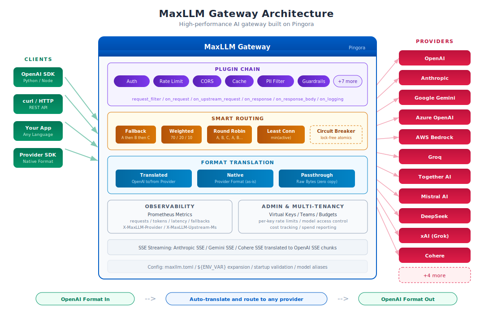
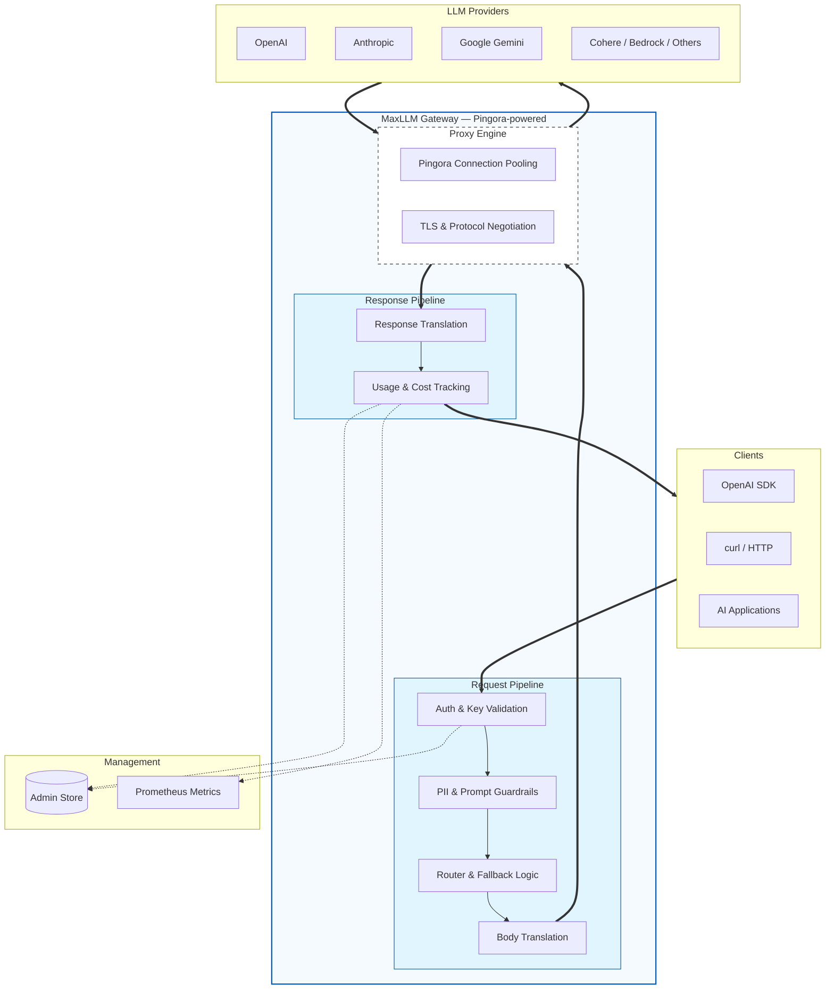
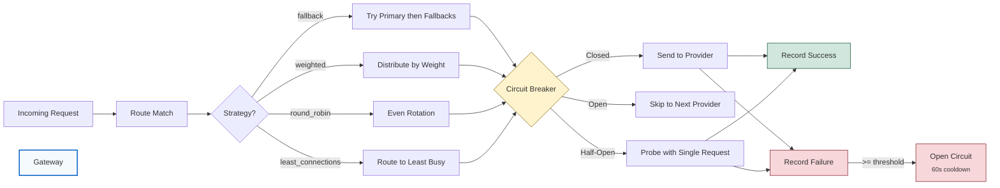

# MaxLLM

[](https://github.com/cloudflare/pingora)
[](https://www.rust-lang.org/)
[](LICENSE)

A high-performance AI gateway built on [Pingora](https://github.com/cloudflare/pingora), the open-source Rust framework that powers a significant portion of Cloudflare's global network. MaxLLM acts as a reverse proxy that accepts OpenAI-format requests and routes them to any supported LLM provider, translating request/response formats transparently.

**One SDK. Any provider. Zero code changes.**

<p align="center">
  
</p>

## Features

- **15 LLM providers** &mdash; OpenAI, Anthropic, Gemini, Azure, Bedrock, Groq, Together, Fireworks, Mistral, xAI, DeepSeek, Ollama, Cohere, DeepInfra, and any OpenAI-compatible endpoint
- **Three input modes** &mdash; OpenAI-format with translation, native provider format (Anthropic Messages API, Gemini, etc.), or raw pass-through
- **Streaming support** &mdash; SSE streaming with real-time format translation (Anthropic SSE, Gemini SSE, Cohere SSE &rarr; OpenAI SSE)
- **Smart routing** &mdash; Fallback chains, weighted load balancing, round-robin, least-connections, with per-provider circuit breakers
- **Plugin system** &mdash; 13 built-in plugins (auth, rate limiting, CORS, caching, PII filtering, prompt injection detection, and more)
- **Guardrails** &mdash; Content-level guardrails with 8 providers (built-in, webhook, Lakera AI, CEL expressions)
- **Virtual keys** &mdash; Multi-tenant key management with per-key budgets, rate limits, model access control, and team grouping
- **Cost tracking** &mdash; Automatic cost calculation with built-in model pricing for 10+ model families
- **Observability** &mdash; Prometheus metrics, structured tracing, response headers (`X-MaxLLM-Provider`, `X-MaxLLM-Upstream-Ms`)

## Quick Start

```bash
# Build
cargo build --release

# Set provider API keys
export OPENAI_API_KEY="sk-..."
export ANTHROPIC_API_KEY="sk-ant-..."

# Run
./target/release/maxllm --config maxllm.toml

# Send a request
curl http://localhost:8080/v1/chat/completions \
  -H "Authorization: Bearer sk-maxllm-dev-key" \
  -H "Content-Type: application/json" \
  -d '{
    "model": "gpt-4o-mini",
    "messages": [{"role": "user", "content": "Hello!"}]
  }'
```

The same request works for any provider &mdash; just change the route:

```bash
# Anthropic (auto-translated to Messages API)
curl http://localhost:8080/v1/anthropic -H "Authorization: Bearer sk-maxllm-dev-key" \
  -H "Content-Type: application/json" \
  -d '{"model": "claude-sonnet-4-20250514", "messages": [{"role": "user", "content": "Hello!"}]}'

# Gemini (auto-translated to generateContent API)
curl http://localhost:8080/v1/gemini -H "Authorization: Bearer sk-maxllm-dev-key" \
  -H "Content-Type: application/json" \
  -d '{"model": "gemini-2.5-flash", "messages": [{"role": "user", "content": "Hello!"}]}'

# Local Ollama
curl http://localhost:8080/v1/ollama -H "Authorization: Bearer sk-maxllm-dev-key" \
  -H "Content-Type: application/json" \
  -d '{"model": "gemma3:1b", "messages": [{"role": "user", "content": "Hello!"}]}'
```

### Native Provider Endpoints

Send requests in the provider's native format &mdash; no translation, full access to provider-specific features:

```bash
# Anthropic Messages API (native format, supports thinking blocks, etc.)
curl http://localhost:8080/v1/messages -H "Authorization: Bearer sk-maxllm-dev-key" \
  -H "Content-Type: application/json" \
  -d '{"model": "claude-sonnet-4-20250514", "max_tokens": 1024, "messages": [{"role": "user", "content": "Hello!"}]}'

# Gemini generateContent API (native format)
curl http://localhost:8080/v1beta/models/gemini-2.5-flash:generateContent \
  -H "Authorization: Bearer sk-maxllm-dev-key" \
  -H "Content-Type: application/json" \
  -d '{"contents": [{"parts": [{"text": "Hello!"}]}]}'
```

### Pass-Through Endpoints

Raw proxy to any provider API path &mdash; zero body parsing, just auth injection:

```bash
# Pass-through to Anthropic (any endpoint)
curl http://localhost:8080/passthrough/anthropic/v1/messages \
  -H "Authorization: Bearer sk-maxllm-dev-key" \
  -H "Content-Type: application/json" \
  -d '{"model": "claude-sonnet-4-20250514", "max_tokens": 1024, "messages": [{"role": "user", "content": "Hello!"}]}'

# Pass-through to OpenAI (any endpoint, including embeddings, images, etc.)
curl http://localhost:8080/passthrough/openai/v1/embeddings \
  -H "Authorization: Bearer sk-maxllm-dev-key" \
  -H "Content-Type: application/json" \
  -d '{"model": "text-embedding-3-small", "input": "Hello world"}'
```

## Supported Providers

| Provider | Kind | Format | Auth |
|----------|------|--------|------|
| OpenAI | `openai` | Passthrough | Bearer token |
| Anthropic | `anthropic` | Full translation | x-api-key |
| Google Gemini | `gemini` | Full translation | API key query param |
| Azure OpenAI | `azure_openai` | Passthrough | api-key header |
| AWS Bedrock | `bedrock` | Anthropic format | AWS SigV4 |
| Groq | `groq` | OpenAI-compatible | Bearer token |
| Together AI | `together` | OpenAI-compatible | Bearer token |
| Fireworks AI | `fireworks` | OpenAI-compatible | Bearer token |
| DeepInfra | `deepinfra` | OpenAI-compatible | Bearer token |
| Mistral AI | `mistral` | OpenAI-compatible | Bearer token |
| xAI (Grok) | `xai` | OpenAI-compatible | Bearer token |
| DeepSeek | `deepseek` | OpenAI-compatible | Bearer token |
| Ollama | `ollama` | OpenAI-compatible | None (local) |
| Cohere | `cohere` | Full translation | Bearer token |
| Custom | `openai_compat` | OpenAI-compatible | Configurable |

## Configuration

MaxLLM uses a single TOML config file with `${ENV_VAR}` expansion. See [maxllm.toml](maxllm.toml) for a full example.

### Providers

```toml
[providers.openai]
kind = "openai"
base_url = "https://api.openai.com"
api_key = "${OPENAI_API_KEY}"
default_model = "gpt-4o"

[providers.anthropic]
kind = "anthropic"
base_url = "https://api.anthropic.com"
api_key = "${ANTHROPIC_API_KEY}"
default_model = "claude-sonnet-4-20250514"
```

### Routes

Routes support three endpoint types:

| Type | Config Value | Description |
|------|-------------|-------------|
| **Translated** | `chat_completions` (default) | Client sends OpenAI format; gateway translates to/from provider |
| **Native** | `native` | Client sends provider-native format; gateway forwards as-is with metadata extraction |
| **Pass-through** | `passthrough` | Raw reverse proxy; zero body parsing, just auth + logging |

```toml
# Translated (default) — OpenAI format in, provider format out
[[routes]]
path = "/v1/chat/completions"
provider = "openai"
fallback = ["anthropic", "groq"]
strategy = "fallback"
timeout_secs = 120
plugins = ["rate_limiter", "cors"]
guardrails = ["injection-guard"]

# Native — Anthropic Messages API format directly
[[routes]]
path = "/v1/messages"
provider = "anthropic"
endpoint_type = "native"
plugins = ["rate_limiter", "cors"]

# Native — Gemini generateContent format directly
[[routes]]
path = "/v1beta/models"
provider = "gemini"
endpoint_type = "native"
plugins = ["rate_limiter", "cors"]

# Pass-through — raw proxy to any Anthropic endpoint
[[routes]]
path = "/passthrough/anthropic"
provider = "anthropic"
endpoint_type = "passthrough"
plugins = ["rate_limiter"]
```

For pass-through routes, the path suffix after the route prefix is forwarded to the upstream provider (e.g., `/passthrough/anthropic/v1/messages` proxies to `https://api.anthropic.com/v1/messages`).

### Plugins

```toml
global_plugins = ["request_id", "api_auth"]

[plugins.api_auth]
category = "key_auth"
header = "Authorization"
strip_prefix = "Bearer "
keys = ["sk-maxllm-dev-key"]

[plugins.rate_limiter]
category = "rate_limit"
requests_per_minute = 600
key = "client_ip"
```

### Model Aliases

```toml
[model_aliases]
"gpt-4" = "gpt-4o"
"claude-3" = "claude-sonnet-4-20250514"
```

## Routing Strategies

| Strategy | Config Value | Description |
|----------|-------------|-------------|
| Fallback | `fallback` | Try primary provider, then fallbacks in order (default) |
| Weighted | `weighted` | Distribute traffic by configured provider weights |
| Round Robin | `round_robin` | Even distribution across all providers |
| Least Connections | `least_connections` | Route to the least busy provider |

All strategies include automatic **circuit breaking**: providers are temporarily removed from rotation after consecutive failures (default: 3 failures, 60s recovery). The circuit breaker is lock-free (AtomicU32/U64).

## Plugins

13 built-in plugins with 5 lifecycle hooks (`on_request`, `on_upstream_request`, `on_response`, `on_response_body`, `on_logging`):

| Plugin | Category | Purpose |
|--------|----------|---------|
| key_auth | `key_auth` | Bearer token authentication |
| rate_limit | `rate_limit` | Sliding-window rate limiter |
| request_id | `request_id` | UUIDv7 request ID generation |
| cors | `cors` | CORS preflight + response headers |
| ip_restriction | `ip_restriction` | IP allow/deny lists with CIDR support |
| cache | `cache` | In-memory LRU response cache with TTL |
| webhook | `webhook` | Structured JSON logging for observability |
| pii_filter | `pii_filter` | PII detection (email, SSN, credit card, phone, IP) |
| keyword_block | `keyword_block` | Keyword/phrase blocking |
| max_size | `max_size` | Request body size and token limits |
| prompt_guard | `prompt_guard` | Prompt injection/jailbreak detection (6 built-in rules) |
| secret_scan | `secret_scan` | Secret/credential detection (9 built-in patterns) |
| regex_guard | `regex_guard` | Custom regex-based content rules |

## Guardrails

Guardrails operate on parsed message content (not raw HTTP) and support pre-call, post-call, or both lifecycle modes.

### Providers

| Provider | Type | Description |
|----------|------|-------------|
| `prompt_guard` | Built-in | Prompt injection/jailbreak detection |
| `pii_filter` | Built-in | PII detection and redaction |
| `secret_scan` | Built-in | Secret/credential detection |
| `keyword_block` | Built-in | Keyword/phrase blocking |
| `regex_guard` | Built-in | Custom regex pattern matching |
| `webhook` | External | Generic HTTP webhook (any guardrail service) |
| `lakera` | External | [Lakera AI](https://www.lakera.ai/) prompt injection detection |
| `cel` | Expression | [CEL](https://cel.dev/) programmable policy rules |

### Configuration

```toml
[[guardrails]]
name = "injection-guard"
provider = "prompt_guard"
mode = "pre_call"                      # pre_call | post_call | both
default_on = true                      # always runs, even if client doesn't request it
action = "block"                       # block | redact | log_only

[[guardrails]]
name = "cel-policy"
provider = "cel"
mode = "pre_call"
default_on = true
action = "block"
[[guardrails.rules]]
name = "max-prompt-size"
expr = 'size(content) > 50000'
message = "Prompt exceeds maximum allowed size"
```

### Request-Level Selection

Clients can select which guardrails to apply per request:

```json
{
  "model": "gpt-4o",
  "messages": [{"role": "user", "content": "Hello"}],
  "guardrails": ["injection-guard", "pii-check"]
}
```

The `guardrails` field is stripped before forwarding to the upstream provider.

## Virtual Keys & Multi-Tenancy

The admin module provides multi-tenant key management with budgets and cost tracking.

```toml
[admin]
master_key = "${MAXLLM_MASTER_KEY}"
enabled = true
```

| Feature | Description |
|---------|-------------|
| Key generation | `POST /admin/keys` &mdash; generates `sk-maxllm-{uuid}` keys |
| Per-key budgets | USD budgets with auto-reset periods |
| Per-key rate limits | RPM/TPM limits per virtual key |
| Model access control | Restrict which models a key can access |
| Teams | Group keys into teams with team-level budgets |
| Cost tracking | Automatic cost calculation with built-in model pricing |
| Spend reporting | `/admin/spend` with per-key, per-model, per-provider breakdown |

## Observability

### Prometheus Metrics

Available at `GET /metrics` when enabled:

| Metric | Labels | Type |
|--------|--------|------|
| `requests_total` | provider, model, status | Counter |
| `tokens_in_total` | provider, model | Counter |
| `tokens_out_total` | provider, model | Counter |
| `request_duration_seconds` | provider | Histogram |
| `active_requests` | &mdash; | Gauge |
| `fallbacks_total` | from_provider, to_provider | Counter |

### Response Headers

| Header | Description |
|--------|-------------|
| `X-MaxLLM-Provider` | Which provider handled the request |
| `X-MaxLLM-Fallback-From` | Original provider if fallback was used |
| `X-MaxLLM-Upstream-Ms` | Time waiting for upstream (TTFB) |
| `X-MaxLLM-Overhead-Ms` | Gateway processing overhead |
| `X-MaxLLM-Applied-Guardrails` | Which guardrails were applied |

## Architecture

MaxLLM is a **proxy, not a client**. It uses zero HTTP client libraries. Pingora handles all TCP/TLS/HTTP connections, connection pooling, and protocol negotiation. The gateway only mutates headers and bodies as they flow through Pingora's proxy pipeline.

```
crates/
  maxllm-config/        # TOML config parsing, env var expansion, validation
  maxllm-plugin/        # Plugin trait, chain executor, 13 built-in plugins, guardrail framework
  maxllm-translate/     # Provider translation (OpenAI <-> 15 provider formats)
  maxllm-admin/         # Virtual keys, teams, cost tracking, budget enforcement
  maxllm-gateway/       # Main binary: Pingora ProxyHttp implementation + routing
```

### Request Flow



### Routing & Failover



## Performance

Benchmarked on macOS (Apple Silicon), 4 Pingora worker threads:

| Scenario | Req/sec | p99 Latency |
|----------|---------|-------------|
| `/health` (no plugins) | 178,000 | 980us |
| Auth rejection (2 plugins) | 14,000 | 13ms |

Run benchmarks with the included Makefile targets:

```bash
make perf-health    # Health endpoint (pure gateway overhead)
make perf-mock      # Mock upstream (proxy + translation overhead)
make perf-proxy     # Bare proxy (no plugins, routing only)
make perf-stream    # Streaming responses
```

## Development

```bash
make build          # cargo build --release
make dev            # cargo build (debug)
make run            # Build + run with maxllm.toml
make run-debug      # Debug build with RUST_LOG=debug

make test           # Unit tests
make test-integration  # Unit + mock integration tests
make test-live      # Real provider tests (requires Ollama + GEMINI_API_KEY)
make test-all       # Everything

make fmt            # cargo fmt
make check          # cargo check
make clippy         # cargo clippy
```

### CLI Options

```
maxllm [OPTIONS]

OPTIONS:
  -c, --config <CONFIG>    Path to configuration file (default: maxllm.toml)
  -d, --daemon             Enable daemon mode
  -h, --help               Print help
  -V, --version            Print version
```

### Environment Variables

| Variable | Purpose |
|----------|---------|
| `RUST_LOG` | Log level (`info` default, `warn` for benchmarks, `debug` for full detail) |
| `OPENAI_API_KEY` | OpenAI API key |
| `ANTHROPIC_API_KEY` | Anthropic API key |
| `GEMINI_API_KEY` | Google Gemini API key |
| `MAXLLM_MASTER_KEY` | Admin API master key |

> **Note:** Always unset `HTTPS_PROXY` / `HTTP_PROXY` before running &mdash; Pingora routes through them and it breaks TLS to upstream providers.

## Why Pingora?

MaxLLM is built on [Pingora](https://github.com/cloudflare/pingora), an open-source (Apache 2.0) Rust framework created by Cloudflare to handle their HTTP proxy infrastructure. We chose it because:

- **Battle-tested at scale** &mdash; Pingora handles traffic across Cloudflare's global network, processing trillions of requests in production
- **Connection pooling and reuse** &mdash; Built-in HTTP/1.1 and HTTP/2 connection management, reducing latency to upstream LLM providers
- **Zero-copy proxy pipeline** &mdash; Request/response bodies flow through filter hooks without unnecessary allocations; we only mutate what needs translating
- **TLS and protocol negotiation** &mdash; Handled by the framework, not our code; no dependency on separate HTTP client libraries (no reqwest, no hyper client)
- **Async Rust with Tokio** &mdash; Non-blocking I/O across all connections with minimal overhead

This means MaxLLM focuses purely on the AI gateway logic (translation, routing, plugins, guardrails) while Pingora handles the networking layer that has already been proven at internet scale.

## License

[Apache License 2.0](LICENSE)
